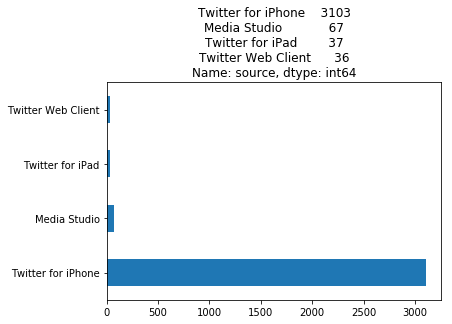
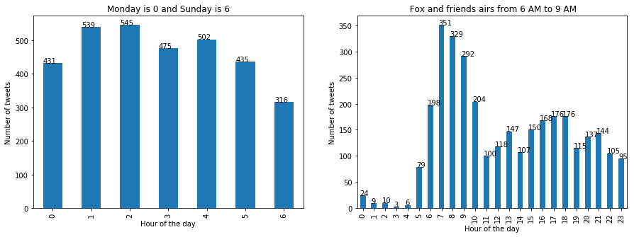
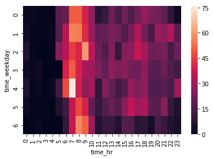

# Temporality of POTUS' tweets:

I am currently enrolled in this course at Stanford continuing studies school titled: _POL 35 — Journalism Under Siege? Truth and Trust in a Time of Turmoil_ (Course link: https://continuingstudies.stanford.edu/courses/liberal-arts-and-sciences/journalism-under-siege-truth-and-trust-in-a-time-of-turmoil/20181_POL-35) 

Week-2 of the course covered the topic "Power to the People: Holding the Powerful Accountable". During the second half of the class, two journalists Sally Buzbee (Executive Editor, The Associated Press) and  Daniel Dale (Correspondent, The Toronto Star) referred to some of the new challenges that have emerged during President-45's administration. They spoke of three aspects of the tweet-storm that emanated from the POTUS himself: _Velocity_, _Source_ and _Timing_

By source, I mean the person and the device from which the tweets were literally typed.
With regards to the temporal aspects, I was exposed to these interesting claims that a substantial chunk of the tweets were being tweeted in the wee hours of the morn and that this timing coincided with the TV show titled 'Fox and Friends'.

Below, I study and quantify this claim in terms of numbers.

The notebook used to reproduce these results are [here](https://github.com/vinayprabhu/TrumpNTwitter/blob/master/Trump%20tweets%20and%20Fox%20and%20friends.ipynb)

TLDR plots:

